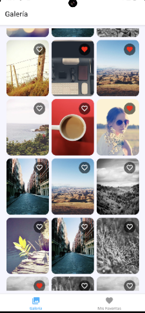
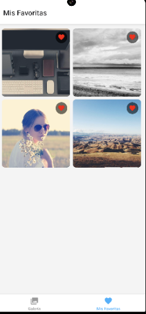

## Prueba Telef - NTT

Esta es una aplicación realizada en React Native/TypeScript, con arquitectura limpia, usando Zustand para el manejo del estado de la app. Muestra galería de fotos con scroll infinito, pagina de favoritos, usando la API de Picsum https://picsum.photos/

## Caracteristicas
* Pantalla principal mostrando una lista de fotos, con la opción de marcar/desmarcar favoritos.
* Persistencia local con AsyncStorage
* Pantalla de favoritas en donde podre encontrar las imagenes preferidas y seleccionadas con anterioridad
* Scroll infinitico con indicador de carga en la obtencion de datos, para que se vayan mostrando de 10 en 10, con el fin de mejorar el rendimiento en la APP.
* Almacenamiento local de imágenes
* Zustand para manejo de estado
* Repository pattern para acceso a datos
* Separación clara de capas según Clean architecture

## Arquitectura
La aplicación sigue Clean Architecture con las siguientes capas:
src/
├── domain/ # Lógica de negocio pura
│ ├── entities/ (PhotoEntity)
│ └── usecases/ (Lógica de negocio)
├── datasources/ # Fuentes de datos
│ ├── repositories/ (PhotoRepository)
│ └── datasources/ (API)
├── presentation/ # UI y componentes
│ └── components/ (CachedImage)
└── store/ # Estado global (Zustand)

## Flujo de Datos

Cuando se ejecuta cualquier tarea que consuma datos, va primero hacia el store (Zustand), que a su vez tiene mencionado a que Use Case necesita traer los datos mediante alguna tarea mencionada en repositorio, trayendo la data del datasource correspondiente.


## A tener en cuenta
El funcionamiento del sistema de caché para la imagen:
* Al cargar una imagen
   - Verifica si existe en la caché local (FileSystem.getInfoAsync)
   - Si existe, usa la versión local
   - Si no existe, descarga la imagen y la guarda en caché (FileSystem.downloadAsync)
* Beneficios
   - Las imágenes se mantienen disponibles sin conexión después de la primera carga
   - Las imágenes locales se cargan más rápido que las remotas
   - Reduce el consumo de datos móviles
   - Las imágenes permanecen en caché entre sesiones de la app

## Herramientas
* React Native CLI / TypeScript
* Zustand - Manejo del estado global
* Axios - Al momento de consumir la API
* API de Picsum https://picsum.photos/

## Instalación

1. Install dependencies

   ```bash
   npm install
   ```

2. Start the app

   ```bash
    npx expo start
   ```

## Evidencia

